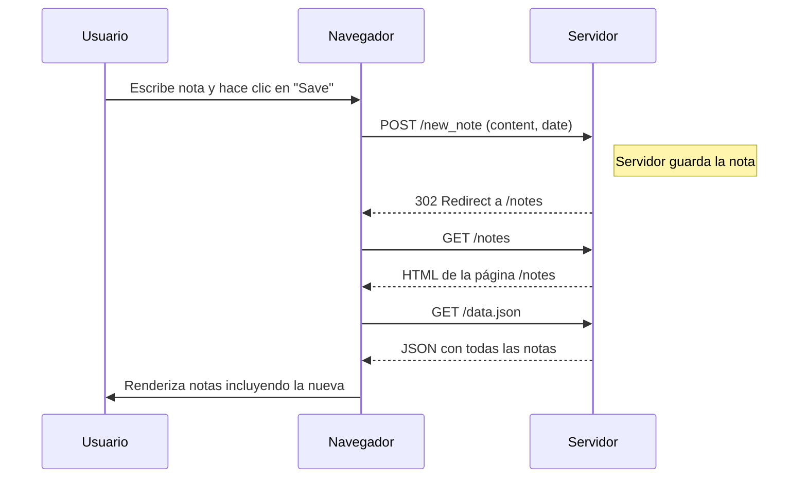

```mermaid
sequenceDiagram
    participant U as Usuario
    participant B as Navegador
    participant S as Servidor

    U->>B: Escribe nota y hace clic en "Save"
    B->>S: POST /new_note (content, date)
    Note right of S: Servidor guarda la nota
    S-->>B: 302 Redirect a /notes
    B->>S: GET /notes
    S-->>B: HTML de la página /notes
    B->>S: GET /data.json
    S-->>B: JSON con todas las notas
    B->>U: Renderiza notas incluyendo la nueva
```
